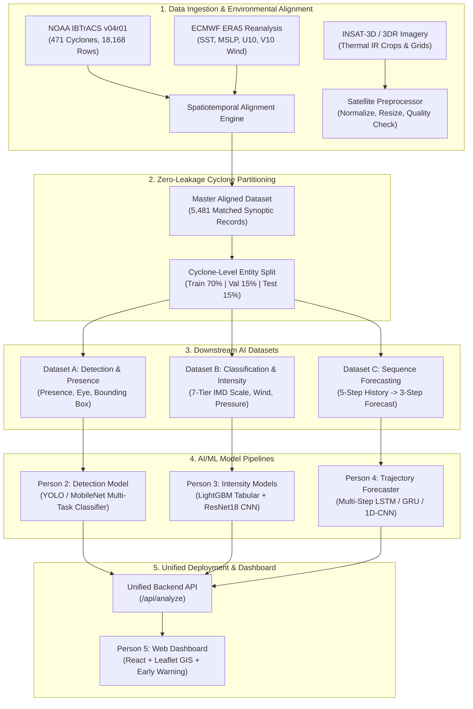

# 🌀 SIH 2026 — PS 26070: Tropical Cyclone AI/ML System

<p align="center">
  
  
  
  
  
  
</p>

---

## 📌 Project Overview

**Problem Statement 26070 (SIH 2026)** focuses on building an **end-to-end AI/ML decision-support system** for the **Ministry of Earth Sciences (MoES)** and **India Meteorological Department (IMD)** to identify, classify, and forecast tropical cyclone patterns in the **North Indian Ocean (NIO) Basin** (Bay of Bengal and Arabian Sea).

By unifying **NOAA IBTrACS v04r01** best-track ground truth, **ECMWF ERA5** high-resolution atmospheric & oceanic reanalysis, and **INSAT-3D/3DR** satellite imagery, this platform delivers structured datasets, baseline models, inference APIs, and ready-to-train deep learning pipelines for:
1. **Cyclonic Disturbance & Eye Detection** (Presence & Dvorak structural pattern tagging).
2. **Multi-Source Intensity Classification** (7-tier official IMD scale + continuous wind/pressure regression).
3. **Spatiotemporal Trajectory & Intensity Forecasting** (Multi-horizon $+6\text{h}$, $+12\text{h}$, $+24\text{h}$ track coordinates & wind speed).

---

## 📑 Table of Contents

- [✨ Key Highlights & Capabilities](#-key-highlights--capabilities)
- [🏗️ End-to-End System Architecture](#️-end-to-end-system-architecture)
- [📁 Repository Structure](#-repository-structure)
- [📊 Dataset Specifications & Catalog](#-dataset-specifications--catalog)
- [🏷️ IMD / RSMC Intensity Classification Scale](#️-imd--rsmc-intensity-classification-scale)
- [🚀 Quickstart & PyTorch DataLoaders](#-quickstart--pytorch-dataloaders)
- [🧠 Subsystem Implementation Deep-Dives (Future Tasks)](#-subsystem-implementation-deep-dives-future-tasks)
  - [Person 2: Cyclone Detection & Structural Pattern Recognition](#-person-2-cyclone-detection--structural-pattern-recognition)
  - [Person 3: Multi-Source Classification & Intensity Estimation](#-person-3-multi-source-classification--intensity-estimation)
  - [Person 4: Spatiotemporal Trajectory & Wind Forecasting](#-person-4-spatiotemporal-trajectory--wind-forecasting)
  - [Person 5: Web Dashboard & System Integration](#-person-5-web-dashboard--system-integration)
- [🔗 Unified API Contract (`/api/analyze`)](#-unified-api-contract-apianalyze)
- [📅 Consolidated 8-Day Development Roadmap](#-consolidated-8-day-development-roadmap)
- [🔄 Data Pipeline Reproduction](#-data-pipeline-reproduction)
- [✅ QA & Verification Pipeline](#-qa--verification-pipeline)
- [📜 License & Acknowledgments](#-license--acknowledgments)

---

## ✨ Key Highlights & Capabilities

- 🛰️ **Multi-Source Environmental Reanalysis Fusion**: Exact spatiotemporal alignment of ECMWF ERA5 variables (Sea Surface Temperature, Mean Sea Level Pressure, 10m U/V Wind components) against NOAA IBTrACS tracks across 1980–2025 with **100.0% coverage (0 missing values)**.
- 🛡️ **Zero-Data-Leakage Cyclone-Level Partitioning**: Strict 70% Train / 15% Validation / 15% Test dataset splits partitioned exclusively by distinct `cyclone_id` entities, preventing temporal and spatial cross-contamination.
- ⏱️ **Sliding-Window Temporal Sequences**: 3,076 sliding-window temporal sequence arrays ($t-24\text{h} \dots t$) paired with future forecasting vectors ($t+6\text{h}, t+12\text{h}, t+24\text{h}$).
- 📦 **Plug-and-Play PyTorch DataLoaders**: Modular dataset classes with built-in shape assertions, feature normalization metrics, and near-real-time satellite frame preprocessing.
- 📈 **Standardized IMD Scale Compliance**: Direct mapping to RSMC New Delhi / IMD cyclone nomenclature, Dvorak T-number scales, central pressure deficit, and sustained wind speed bounds.
- 📐 **Scientifically Rigorous Baselines & Metrics**: Persistence movement-vector baselines, Haversine Great-Circle distance evaluation, and multi-source comparative ablation studies.

---

## 🏗️ End-to-End System Architecture



---

## 📁 Repository Structure

```
PS70/
├── README.md                            # Comprehensive project overview & quickstart
├── LICENSE                              # MIT License
├── PS70_Person1_Status.md               # Data engineering deliverables & handoff report
│
├── build_datasets.py                    # Master dataset builder & sliding window sequence generator
├── clean_kaggle_intensity.py            # INSAT infrared satellite image processor & metadata joiner
├── download_era5.py                     # Copernicus Climate Data Store (CDS API) downloader
├── extract_era5_at_points.py            # Spatiotemporal nearest-neighbor ERA5 reanalysis extractor
├── get_ibtracs.py                       # NOAA IBTrACS downloader, filter & IMD scale converter
│
├── data/
│   ├── metadata/                        # Cleaned ground-truth manifests & partition indexes
│   │   ├── ibtracs_clean.csv            # 18,168 cleaned North Indian Ocean records (1980-2025)
│   │   ├── ibtracs_with_era5.csv        # 5,481 observations merged with atmospheric reanalysis
│   │   ├── master_dataset.csv           # Aligned master dataset with all environmental parameters
│   │   ├── train.csv, validation.csv, test.csv
│   │   └── train_cyclones.csv, validation_cyclones.csv, test_cyclones.csv
│   │
│   ├── processed/                       # Ready-to-train datasets for downstream models
│   │   ├── detection/                   # Dataset A: Cyclone presence & Dvorak structural patterns
│   │   │   ├── train_detection.csv, val_detection.csv, test_detection.csv, detection_all.csv
│   │   │   └── README.md
│   │   ├── classification/              # Dataset B: Multi-source tabular + INSAT IR crops
│   │   │   ├── multisource_train.csv, multisource_val.csv, multisource_test.csv
│   │   │   ├── image_only_kaggle/       # Images and corresponding split label CSVs
│   │   │   └── README.md
│   │   └── forecasting/                 # Dataset C: Sliding window temporal sequences (.npz)
│   │       ├── train_sequences.npz, val_sequences.npz, test_sequences.npz
│   │       ├── train_sequences_metadata.csv, val_sequences_metadata.csv, test_sequences_metadata.csv
│   │       └── README.md
│   │
│   ├── qa_reports/                      # Quality assurance validation reports & artifacts
│   │   ├── QA_REPORT.md                 # Statistical distribution & validation documentation
│   │   └── figures/                     # Track plots, frequency charts, intensity distributions
│   │
│   └── raw/                             # Raw ingested data sources (IBTrACS, ERA5 NetCDF, INSAT)
│
├── docs/
│   └── ERA5_ALIGNMENT.md                # Technical specification of atmospheric & ocean variables
│
├── future_task/                         # Implementation roadmaps & tasks for downstream developers
│   ├── tasks.md                         # Master team roadmap & unified API specification
│   ├── tasks2.md                        # Person 2 Guide: Cyclone Detection & Presence
│   ├── tasks3.md                        # Person 3 Guide: Multi-Source Classification & Intensity
│   └── tasks4.md                        # Person 4 Guide: Trajectory & Wind Forecasting
│
├── scripts/
│   └── qa_visualization.py              # Automated QA reporting & chart generation script
│
└── src/
    └── data/                            # Standardized PyTorch Datasets & DataLoaders
        ├── __init__.py
        ├── classification_dataset.py     # MultisourceClassificationDataset & CycloneImageDataset
        ├── dataloader_example.py         # End-to-end DataLoader verification script
        ├── detection_dataset.py          # CycloneDetectionDataset
        ├── forecasting_dataset.py        # CycloneForecastingDataset (X: (N,5,7), Y: (N,3,3))
        └── preprocess_satellite.py       # Near-real-time single frame inference preprocessor
```

---

## 📊 Dataset Specifications & Catalog

| Dataset ID | Subsystem Target | Format / Modality | Sample Counts (Train / Val / Test) | Features / Tensor Shape | Target Variables |
|---|---|---|---|---|---|
| **Master** | Central Repository | Tabular (`.csv`) | 3,911 / 752 / 818 (Total: 5,481) | `lat, lon, wind_speed, pressure, sst, wind_u, wind_v, pressure_msl` | Cleaned Synoptic Ground Truth |
| **Dataset A** | Detection & Presence | Tabular & BBox Meta | 93 / 19 / 21 (Total: 133) | Image Path / Geo-Coordinates / Metadata | `detected`, `structural_pattern`, `category` |
| **Dataset B (Multi)** | Classification & Intensity | Tabular Multi-Source | 3,039 / 518 / 651 (Total: 4,208) | 7 Features: `lat, lon, pressure, sst, wind_u, wind_v, pressure_msl` | `category_idx`, `wind_speed`, `pressure` |
| **Dataset B (Img)** | Classification & Intensity | INSAT IR Imagery | 93 / 19 / 21 (Total: 133) | Grayscale IR Images ($256 \times 256$) | `category_idx`, `wind_speed` |
| **Dataset C** | Track & Wind Forecasting | Temporal Arrays (`.npz`) | 2,275 / 378 / 423 (Total: 3,076) | **Input $X$:** `(N, 5, 7)`<br/>5 timesteps ($t-24\text{h} \dots t$) | **Target $Y$:** `(N, 3, 3)`<br/>$+6\text{h}, +12\text{h}, +24\text{h}$ (`lat, lon, wind`) |

---

## 🏷️ IMD / RSMC Intensity Classification Scale

All classification and regression targets conform strictly to the **India Meteorological Department (IMD) / Regional Specialized Meteorological Centre (RSMC) New Delhi** operational classification:

| Class Index | IMD Category Name | Short Code | Sustained Wind Speed (knots) | Sustained Wind Speed (km/h) | Pressure Deficit ($\Delta P$, hPa) | Dvorak T-Number |
|:---:|---|:---:|:---:|:---:|:---:|:---:|
| `0` | **Depression** | D | 17 – 27 kts | 31 – 49 km/h | 1.0 – 3.0 hPa | T1.5 |
| `1` | **Deep Depression** | DD | 28 – 33 kts | 50 – 61 km/h | 3.0 – 4.5 hPa | T2.0 |
| `2` | **Cyclonic Storm** | CS | 34 – 47 kts | 62 – 88 km/h | 4.5 – 8.5 hPa | T2.5 – T3.0 |
| `3` | **Severe Cyclonic Storm** | SCS | 48 – 63 kts | 89 – 117 km/h | 8.5 – 15.5 hPa | T3.5 |
| `4` | **Very Severe Cyclonic Storm** | VSCS | 64 – 89 kts | 118 – 166 km/h | 15.5 – 31.5 hPa | T4.0 – T4.5 |
| `5` | **Extremely Severe Cyclonic Storm** | ESCS | 90 – 119 kts | 167 – 221 km/h | 31.5 – 65.5 hPa | T5.0 – T5.5 |
| `6` | **Super Cyclonic Storm** | SuCS | $\ge 120$ kts | $\ge 222$ km/h | $\ge 65.6$ hPa | $\ge$ T6.0 |

---

## 🚀 Quickstart & PyTorch DataLoaders

The repository includes high-performance data loaders compatible with standard PyTorch `DataLoader` pipelines and standalone NumPy/Pandas environments.

### 1. Trajectory & Wind Forecasting (Dataset C — Person 4)
```python
from torch.utils.data import DataLoader
from src.data.forecasting_dataset import CycloneForecastingDataset

# Load 5-step history (t-24h..t) and 3-step forecast targets (+6h, +12h, +24h)
train_dataset = CycloneForecastingDataset(split="train")
train_loader = DataLoader(train_dataset, batch_size=32, shuffle=True)

for x_batch, y_batch in train_loader:
    # x_batch: torch.Tensor of shape (32, 5, 7) -> [lat, lon, wind_speed, pressure, sst, wind_u, wind_v]
    # y_batch: torch.Tensor of shape (32, 3, 3) -> [lat, lon, wind_speed] across (+6h, +12h, +24h)
    print(f"Batch X: {x_batch.shape}, Batch Y: {y_batch.shape}")
    break
```

### 2. Multi-Source Intensity Classification (Dataset B — Person 3)
```python
from torch.utils.data import DataLoader
from src.data.classification_dataset import MultisourceClassificationDataset, CycloneImageDataset

# Multi-source tabular loader (IBTrACS + ERA5 reanalysis features)
ms_dataset = MultisourceClassificationDataset(split="train")
ms_loader = DataLoader(ms_dataset, batch_size=64, shuffle=True)

for features, cat_idx, wind_speed, pressure in ms_loader:
    # features: (64, 7), cat_idx: (64,), wind_speed: (64,), pressure: (64,)
    print(f"Tabular features shape: {features.shape}, Class targets: {cat_idx.shape}")
    break

# Image-only INSAT infrared crop loader
img_dataset = CycloneImageDataset(split="train")
img_loader = DataLoader(img_dataset, batch_size=16, shuffle=True)

for images, cat_idx, wind_speed in img_loader:
    # images: (16, 1, 256, 256)
    print(f"Satellite batch shape: {images.shape}")
    break
```

### 3. Cyclone Detection & Structural Pattern Recognition (Dataset A — Person 2)
```python
from torch.utils.data import DataLoader
from src.data.detection_dataset import CycloneDetectionDataset

det_dataset = CycloneDetectionDataset(split="train")
det_loader = DataLoader(det_dataset, batch_size=32, shuffle=True)

for batch in det_loader:
    # batch['detected']: (32,), batch['structural_pattern']: list of strings, batch['category']: list of strings
    print(f"Detected flags: {batch['detected'][:5]}")
    print(f"Structural patterns: {batch['structural_pattern'][:5]}")
    break
```

### 4. Near-Real-Time Single Frame Ingestion Preprocessing
```python
from src.data.preprocess_satellite import preprocess_single_frame

# Ingest and validate incoming INSAT-3D/3DR imagery
frame = preprocess_single_frame(
    "data/processed/classification/image_only_kaggle/images/101.jpg",
    target_size=(256, 256),
    normalize=True
)
print(f"Frame status: {frame['status']}, Tensor shape: {frame['image'].shape}")
```

### 5. Verify All Loaders in One Command
```bash
python src/data/dataloader_example.py
```

---

## 🧠 Subsystem Implementation Deep-Dives (Future Tasks)

This section consolidates all implementation specifications, loss formulations, architectural designs, and handoff requirements from the [`future_task/`](file:///D:/AVV/SIH2026/PS70/future_task/tasks.md) technical guides.

---

### 👁️ Person 2: Cyclone Detection & Structural Pattern Recognition

#### Implementation Status

A multi-task cyclone detection model has been implemented using a pretrained **MobileNetV3-Small** backbone.

The model predicts three outputs from a satellite image:

1. **Cyclone Presence**
   - Binary classification
   - Determines whether a cyclone is detected in the image.

2. **Structural Pattern**
   - `eye_visible`
   - `curved_band`
   - `shear_pattern`

3. **IMD Cyclone Category**
   - Depression
   - Deep Depression
   - Cyclonic Storm
   - Severe Cyclonic Storm
   - Very Severe Cyclonic Storm
   - Extremely Severe Cyclonic Storm
   - Super Cyclonic Storm

---

#### Model Architecture

The implemented model uses a shared MobileNetV3-Small feature extractor with three independent classification heads.

```text
Satellite Image
       │
       ▼
MobileNetV3-Small Backbone
       │
       ▼
Shared Feature Representation
       │
 ┌─────┼───────────┐
 ▼     ▼           ▼
Presence Pattern   Category
Head     Head       Head
```


---

#### Training

The model was trained for **10 epochs** using:

```text
Batch Size: 16
Learning Rate: 0.0001
Optimizer: Adam
Backbone: MobileNetV3-Small
Device: CPU
```

Training and validation loss decreased during training.

Final training results:

```text
Epoch 10 Training Loss: 1.9493
Epoch 10 Validation Loss: 2.7200
```

The best validation checkpoint was saved as:

```text
models/detection/model_weights.pt
```

---

#### Test Dataset Evaluation

The trained model was evaluated on the held-out test dataset.

| Metric | Structural Pattern | Cyclone Category |
|---|---:|---:|
| Accuracy | 0.7143 | 0.3333 |
| Precision | 0.7524 | 0.2566 |
| Recall | 0.7143 | 0.3333 |
| F1 Score | 0.6307 | 0.2305 |

The structural pattern classifier achieved stronger performance than the category classifier.

The lower category classification performance is expected because the dataset contains a relatively small and imbalanced number of satellite images across the seven IMD cyclone categories.

Detailed evaluation metrics are available in:

```text
metrics/detection_metrics.json
```

---

#### Sample Prediction

Example inference output:

```text
Cyclone Detected: True
Detection Confidence: 0.9641

Structural Pattern: eye_visible
Pattern Confidence: 0.6007

Predicted Category: Cyclonic Storm
Category Confidence: 0.2784
```

The corresponding visualization is available at:

```text
models/detection/sample_prediction.png
```

---

#### Running Training

```bash
python src/detection/train.py
```

This trains the multi-task detection model and saves the best model checkpoint.

---

#### Running Evaluation

```bash
python src/detection/evaluate.py
```

This evaluates the trained model on the test dataset and generates evaluation metrics.

---

#### Running Inference

```python
from src.detection.inference import detect_cyclone

result = detect_cyclone(
    "path/to/cyclone_image.jpg"
)

print(result)
```

Example output:

```python
{
    "detected": True,
    "confidence": 0.9641,
    "structural_pattern": "eye_visible",
    "pattern_confidence": 0.6007,
    "category": "Cyclonic Storm",
    "category_confidence": 0.2784
}
```

---

#### Person 2 Deliverables

- [x] `src/data/detection_dataset.py`
- [x] `src/detection/detector.py`
- [x] `src/detection/train.py`
- [x] `src/detection/evaluate.py`
- [x] `src/detection/inference.py`
- [x] `models/detection/model_weights.pt`
- [x] `models/detection/sample_prediction.png`
- [x] `metrics/detection_metrics.json`
- [x] Training pipeline
- [x] Test evaluation
- [x] Stand-alone inference

---

### 🌪️ Person 3: Multi-Source Classification & Intensity Estimation
*Detailed Guide:* [`future_task/tasks3.md`](file:///D:/AVV/SIH2026/PS70/future_task/tasks3.md)

#### 1. Objectives & The Multi-Source Advantage Hypothesis
Person 3 evaluates cyclone severity through dual deliverables:
1. **7-Tier IMD Intensity Classification**: Classify into official IMD scale (`Depression` to `Super Cyclonic Storm`).
2. **Continuous Intensity Regression**: Predict maximum sustained wind speed ($\text{km/h}$) and central pressure ($\text{hPa}$).
3. **Scientific Proof of Multi-Source Value**: Directly quantify the performance lift of fusing atmospheric reanalysis (ERA5: SST, MSLP, U10, V10) with satellite imagery compared to single-sensor image baselines.

#### 2. Model Implementations
- **Model A (Image-Only Baseline)**: `ResNet18` on 133 INSAT IR crops with dual heads (7-class Cross-Entropy + Wind Speed Linear Regressor).
- **Model B (Multi-Source Tabular)**: Gradient Boosted Decision Trees (`LightGBM` / `XGBoost`) trained on 4,208 synoptic records with features `[lat, lon, sst, pressure_msl, wind_u, wind_v]`.
- **Model C (Multimodal Fusion)**:
  $$\text{Embedding}_{\text{Fused}} = \Big[ \text{CNN}(\text{Satellite Frame}) \;\Big\|\; \text{MLP}(\text{SST}, \text{MSLP}, U_{10}, V_{10}, \text{Lat}, \text{Lon}) \Big]$$

#### 3. Required Comparative Evaluation Matrix:
| Metric | Image-Only Baseline | Multi-Source Model | Performance Delta |
|---|:---:|:---:|:---:|
| **IMD Category Accuracy (%)** | $X.X\%$ | $Y.Y\%$ | $+Z.Z\%$ Lift |
| **Category Macro F1-Score** | $0.XX$ | $0.YY$ | $+0.ZZ$ |
| **Wind Speed MAE ($\text{km/h}$)** | $XX.X\text{ km/h}$ | $YY.Y\text{ km/h}$ | $-W.W\text{ km/h (Error Reduction)}$ |
| **Wind Speed RMSE ($\text{km/h}$)** | $XX.X\text{ km/h}$ | $YY.Y\text{ km/h}$ | $-W.W\text{ km/h}$ |

#### 4. Required Handoff Package Checklist:
- [ ] `models/classification/classifier.pt` or `lgbm_classifier.pkl`
- [ ] `models/classification/intensity_model.pt` or `lgbm_regressor.pkl`
- [ ] `src/classification/classifier.py` & `src/classification/inference.py` (`classify_cyclone()`)
- [ ] `src/classification/evaluate.py` & `models/classification/metrics_comparison.json`
- [ ] `models/classification/confusion_matrix.png`
- [ ] `src/classification/README.md`

---

### 🗺️ Person 4: Spatiotemporal Trajectory & Wind Forecasting
*Detailed Guide:* [`future_task/tasks4.md`](file:///D:/AVV/SIH2026/PS70/future_task/tasks4.md)

#### 1. Objectives & Multi-Horizon Targets
Predict the future geographic coordinates ($\text{Latitude}, \text{Longitude}$) and maximum sustained wind speed ($\text{km/h}$) across **3 synoptic lead times**:
- $+6\text{ Hours}$ (Short-range emergency alert)
- $+12\text{ Hours}$ (Tactical evacuation trigger)
- $+24\text{ Hours}$ (Regional landfall warning)

#### 2. Physical Movement-Vector Persistence Baseline
To scientifically prove AI forecast value, models are benchmarked against a physical persistence baseline:
- **Velocity Vector Calculation**:
  $$\vec{v}_{\text{recent}} = \frac{\text{pos}(t) - \text{pos}(t-6\text{h})}{6\text{ hours}}$$
- **Position Extrapolation**:
  $$\text{pos}(t + \Delta t) = \text{pos}(t) + \vec{v}_{\text{recent}} \cdot \Delta t$$
- **Intensity Persistence**: $\text{wind}(t + \Delta t) = \text{wind}(t)$

#### 3. Deep Learning Sequence Architecture
- **Architecture**: 2-Layer LSTM / Bi-directional GRU (hidden dimension 64 or 128) + Multi-Head Linear Decoder mapping latent state to $3 \text{ lead times} \times 3 \text{ targets} = 9 \text{ outputs}$.
- **Multi-Task Loss Formulation**:
  $$\mathcal{L} = \text{MSE}(\hat{\text{lat}}, \text{lat}) + \text{MSE}(\hat{\text{lon}}, \text{lon}) + \lambda \cdot \text{MSE}(\hat{\text{wind}}, \text{wind}) \quad (\lambda \approx 0.01)$$

#### 4. Haversine Great-Circle Distance Metric
Track errors must be computed using spherical trigonometry:
$$d = 2 R \arcsin \left( \sqrt{\sin^2\left(\frac{\Delta \phi}{2}\right) + \cos(\phi_1)\cos(\phi_2)\sin^2\left(\frac{\Delta \lambda}{2}\right)} \right) \quad (R = 6371\text{ km})$$

#### 5. Required Track Error Reporting Table:
| Lead Time | Persistence Baseline Error (km) | AI Forecaster Track Error (km) | Track Error Reduction (%) | Wind Speed MAE (km/h) |
|:---:|:---:|:---:|:---:|:---:|
| **+6 Hours** | $XX.X\text{ km}$ | $YY.Y\text{ km}$ | $+ZZ.Z\%$ | $AA.A\text{ km/h}$ |
| **+12 Hours** | $XX.X\text{ km}$ | $YY.Y\text{ km}$ | $+ZZ.Z\%$ | $BB.B\text{ km/h}$ |
| **+24 Hours** | $XX.X\text{ km}$ | $YY.Y\text{ km}$ | $+ZZ.Z\%$ | $CC.C\text{ km/h}$ |

#### 6. Required Handoff Package Checklist:
- [ ] `models/forecasting/forecast_model.pt` (Trained PyTorch weights)
- [ ] `src/forecasting/forecaster.py` (Model definitions)
- [ ] `src/forecasting/baseline.py` (Persistence movement baseline)
- [ ] `src/forecasting/inference.py` (`forecast_cyclone(history_sequence)`)
- [ ] `src/forecasting/evaluate.py` & `models/forecasting/forecast_metrics.json`
- [ ] `models/forecasting/track_predictions.png` (Geographic track comparison maps)
- [ ] `src/forecasting/README.md`

---

### 💻 Person 5: Web Dashboard & System Integration
*Detailed Guide:* [`future_task/tasks.md`](file:///D:/AVV/SIH2026/PS70/future_task/tasks.md)

Person 5 builds the **Interactive Decision-Support & Early Warning Dashboard**:
- **Stack**: React, Tailwind CSS, Leaflet / Mapbox GIS, FastAPI backend.
- **Features**:
  - Live satellite overlay with bounding box, eye center, and structural pattern tags.
  - Interactive $+6\text{h}, +12\text{h}, +24\text{h}$ cone-of-uncertainty trajectory maps.
  - Real-time IMD intensity badges, wind speed meters, and pressure deficit trackers.
  - Automated Landfall Risk Index score (`HIGH` / `MODERATE` / `LOW`).

---

## 🔗 Unified API Contract (`/api/analyze`)

Downstream models converge into a single unified JSON schema consumed by the frontend monitoring dashboard:

```json
{
  "timestamp": "2026-08-29T12:00:00Z",
  "detection": {
    "detected": true,
    "confidence": 0.94,
    "center": { "latitude": 16.52, "longitude": 82.31 },
    "bbox": [420, 190, 600, 370],
    "structural_pattern": "eye_visible"
  },
  "classification": {
    "category": "Severe Cyclonic Storm",
    "imd_code": "SCS",
    "wind_speed_kmh": 145.0,
    "pressure_hpa": 950.0,
    "confidence": 0.91
  },
  "forecast": [
    { "lead_time_hours": 6, "latitude": 17.10, "longitude": 81.60, "wind_speed_kmh": 150.0 },
    { "lead_time_hours": 12, "latitude": 17.80, "longitude": 80.90, "wind_speed_kmh": 155.0 },
    { "lead_time_hours": 24, "latitude": 19.10, "longitude": 79.50, "wind_speed_kmh": 160.0 }
  ],
  "landfall_prediction": {
    "estimated_landfall": true,
    "latitude": 18.42,
    "longitude": 84.91,
    "estimated_time": "2026-08-30T06:00:00Z",
    "risk_level": "HIGH",
    "risk_score": 82
  }
}
```

---

## 📅 Consolidated 8-Day Development Roadmap

| Day | Person 2 (Detection) | Person 3 (Classification) | Person 4 (Forecasting) | Person 5 (Dashboard & API) |
|:---:|---|---|---|---|
| **Day 1** | Inspect `data/processed/detection/`, test loader, setup MobileNetV3 backbone | Inspect `data/processed/classification/`, verify IMD 7-class schema | Inspect `data/processed/forecasting/`, test sequence loaders | Setup React + Leaflet app skeleton & mock API server |
| **Day 2** | Train baseline presence & Dvorak structural classifier | Train Image-Only baseline (ResNet18) on 133 IR images | Implement and evaluate physical Persistence Baseline | Build Leaflet map view & coordinate layer renderer |
| **Day 3** | Implement spatial image augmentations ($\pm 15^\circ$, flips) | Evaluate Image-Only classification accuracy and wind MAE | Implement PyTorch LSTM / GRU recurrent architecture | Build cyclone intensity badge & telemetry card components |
| **Day 4** | Add auxiliary IMD category head / tune multi-task loss | Train Multi-Source tabular models (LightGBM/XGBoost) | Train Track-Only LSTM baseline on $(X, Y)$ sequences | Implement multi-horizon forecast track interpolation |
| **Day 5** | Implement `pixel_to_geo_coords` spatial conversion | Optimize multi-source model and feature importances | Train full environmental LSTM (+ SST, MSLP, U/V wind) | Integrate live satellite image ingestion interface |
| **Day 6** | Build standardized `detect_cyclone()` inference function | Build comparative evaluation table (Image vs Multi-Source) | Calculate Haversine track errors at +6h, +12h, +24h | Connect FastAPI backend to individual inference scripts |
| **Day 7** | Generate test metrics, confusion matrix, sample plots | Implement `classify_cyclone()` & export confusion matrix | Implement `forecast_cyclone()` & plot trajectory maps | End-to-end integration testing of `/api/analyze` |
| **Day 8** | **DELIVERY:** Model weights, scripts, metrics, README | **DELIVERY:** Models, comparison table, README | **DELIVERY:** Forecast weights, error tables, README | **FINAL DEMO:** Live dashboard deployment & presentation |

---

## 🔄 Data Pipeline Reproduction

To rebuild the entire multi-source dataset from scratch:

```bash
# 1. Download and parse NOAA IBTrACS for the North Indian Ocean basin
python get_ibtracs.py

# 2. Download atmospheric and oceanic reanalysis fields from Copernicus ERA5 CDS API
python download_era5.py

# 3. Spatiotemporally align ERA5 variables with IBTrACS track points
python extract_era5_at_points.py

# 4. Clean and standardize INSAT satellite imagery
python clean_kaggle_intensity.py

# 5. Assemble master dataset, zero-leakage splits, and temporal sequences
python build_datasets.py

# 6. Execute validation pipeline and render QA figures
python scripts/qa_visualization.py
```

---

## ✅ QA & Verification Pipeline

- **Automated Validation**: Run `python scripts/qa_visualization.py` to regenerate all QA reports and visual artifacts in `data/qa_reports/`.
- **Validation Artifacts**:
  - `data/qa_reports/QA_REPORT.md` — Statistical summary and completeness metrics.
  - `data/qa_reports/figures/geographic_tracks.png` — Spatiotemporal cyclone trajectory map across the NIO basin.
  - `data/qa_reports/figures/annual_frequency.png` — Multi-decadal cyclone occurrence frequencies.
  - `data/qa_reports/figures/category_distribution.png` — IMD intensity category distributions across splits.
  - `data/qa_reports/figures/wind_vs_pressure.png` — Physical wind-pressure relationship validation.

---

## 📜 License & Acknowledgments

- **License**: Released under the [MIT License](file:///D:/AVV/SIH2026/PS70/LICENSE).
- **Data Acknowledgments**:
  - **NOAA NCEI**: International Best Track Archive for Climate Stewardship ([IBTrACS v04r01](https://www.ncei.noaa.gov/products/international-best-track-archive)).
  - **ECMWF & Copernicus Climate Change Service (C3S)**: ERA5 atmospheric and oceanic single-level reanalysis.
  - **India Meteorological Department (IMD / MoES)**: Cyclone classification scale, operational guidelines, and domain expertise.

